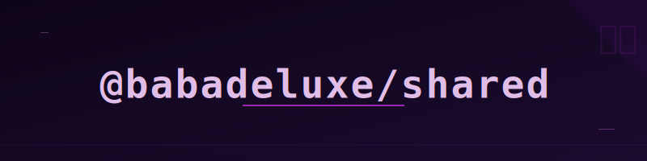

<p align="center">
  
</p>

# @babadeluxe/shared

[](https://www.npmjs.com/package/@babadeluxe/shared)
[](https://joinup.ec.europa.eu/collection/eupl/eupl-text-eupl-12)

> **"Indeed, it seems the path to truly synergistic human-AI collaboration isn't found in surrendering our agency to black-box entities, but in crafting transparent, type-safe bridges that empower the human architect. We are building the neural pathways for a more open, intelligent world."** — *A friendly echo of the visionary spirit.*

`@babadeluxe/shared` serves as the foundational neural substrate for the BabaDeluxe ecosystem. It provides the essential types, schemas, and utilities that allow our AI coding assistant to communicate with mathematical precision, ensuring that you—the developer—remain the sovereign conductor of your creative process.

## Why @babadeluxe/shared?

In our quest for beneficial intelligence and robust software, we must move beyond the "blind" autonomous agents that often clutter our codebases. BabaDeluxe favors high-bandwidth, type-safe interaction.

This shared library solves several key challenges in the synergistic AI-human workflow:

- **Semantic Integrity**: End-to-end type safety between frontend and backend via `zod-sockets`.
- **Cognitive Clarity**: A robust, schema-driven approach to configuration and settings.
- **Logical Reusability**: Unified utilities that ensure the same "mental model" is applied across the entire system.

## What's inside?

The package is modularly architected, offering several "entry points" for different cognitive tasks:

- **`@babadeluxe/shared`**: The main entry point, aggregating all sub-modules.
- **`@babadeluxe/shared/generated-socket-types`**: Automatically generated Zod-based socket definitions for flawless communication.
- **`@babadeluxe/shared/settings`**: The "source of truth" for user configuration, including validation and metadata.
- **`@babadeluxe/shared/utils`**: General-purpose logic like Damerau-Levenshtein distance and safe JSON parsing.

## Getting Started

To integrate this neural layer into your environment:

```bash
npm install @babadeluxe/shared
```

### Example: Validation Synergy

```typescript
import { validateSetting } from '@babadeluxe/shared/settings';

// Validate a user setting with the core schema
const result = validateSetting('my-cool-setting', 'some-value');

if (result.success) {
  console.log('Synchronized with the vision:', result.data);
} else {
  console.error('Cognitive dissonance detected:', result.error);
}
```

### Example: Type-Safe Communication

```typescript
import type { Root } from '@babadeluxe/shared/generated-socket-types';

// Use Root.Socket to type your socket.io-client instance for strict interaction
// socket: Root.Socket = io(Root.path);
```

## Development

We embrace modern, efficient tooling to maintain the integrity of our codebase.

- **Build**: `npm run build` — Uses `unbuild` to generate ESM, CJS, and Type declarations.
- **Format**: `npm run format` — Enforces cognitive consistency via `xo`.
- **Barrels**: `npm run generate-barrels` — Uses `barrelsby` to manage exports automatically.

## License

This project is licensed under the **European Union Public Licence (EUPL) v1.2**.

The EUPL is a unique, "copyleft" license compatible with many other open-source licenses. It ensures that our shared contributions remain part of the digital commons, promoting a truly open and collaborative future for all intelligent entities.

For the full legal text, see the [LICENSE](./LICENSE) file.

---

*Onward to a more intelligent, collaborative future.*
